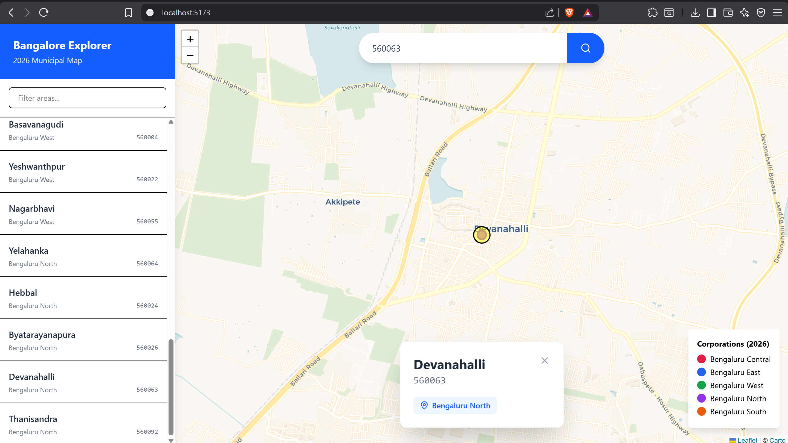

# Bangalore Pincode Map Explorer 🗺️

A full-stack web application built to visualize Bengaluru's newly restructured 5-corporation municipal model (2026). This interactive map allows users to explore localities, search by pincodes or area names, and view detailed corporation assignments.

## App Screenshot
 

## Features
- **Interactive Map:** Displays 25+ key Bengaluru areas using `react-leaflet`.
- **Corporation Color-Coding:** Distinct visual markers for Bengaluru Central, East, West, North, and South.
- **Smart Search (Two-Way):** - Search by 6-digit Pincode to zoom and highlight the area.
  - Search by Area Name (with partial matching support) to find its pincode.
- **Smooth Navigation:** Automatic map panning and "fly-to" animations upon searching.
- **Real-Time Sidebar (Bonus):** A dynamically filtering list of all areas that updates instantly as the user types.

## Tech Stack
**Frontend:**
- React 19 (via Vite)
- Tailwind CSS v4 (Modern Vite plugin integration)
- React-Leaflet & Leaflet.js
- Axios (API requests)
- Lucide React (Icons)

**Backend:**
- Python 3
- FastAPI
- Uvicorn

---

## Local Setup Instructions

Follow these steps to run the application on your local machine. You will need two terminal windows open.

### Prerequisites
- Node.js installed
- Python 3.8+ installed

### 1. Start the Backend (FastAPI)
Open your first terminal and run the following commands:
```bash
# Navigate to the backend directory
cd backend

# Install the required Python dependencies
pip install -r requirements.txt

# Start the FastAPI server
uvicorn main:app --reload
```

### 2. Start the Frontend
Open your second terminal and run the following commands:
```bash
# Navigate to the frontend directory
cd frontend

# Install the required Node dependencies
npm install

# Start the Vite development server
npm run dev
```